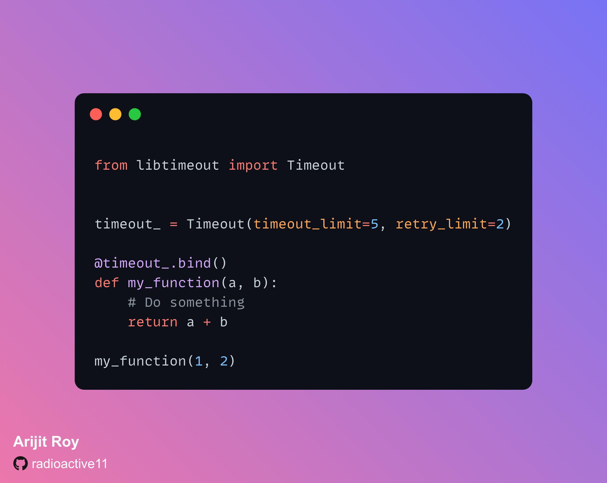

<!-- Improved compatibility of back to top link: See: https://github.com/radioactive11/python-timeout/pull/73 -->
<a name="readme-top"></a>

<!-- PROJECT LOGO -->
<br />
<div align="center">
  <h3 align="center">Python Timeout</h3>

  <p align="center">
    Timeout & retry functions in Python with a single line of code
    <br />
    <a href="https://github.com/radioactive11/python-timeout"><strong>Explore the docs »</strong></a>
    <br />
    ·
    <a href="https://github.com/radioactive11/python-timeout/issues">Report Bug</a>
    ·
    <a href="https://github.com/radioactive11/python-timeout/issues">Request Feature</a>
    ·
  </p>
</div>


<!-- TABLE OF CONTENTS -->
<details>
  <summary>Table of Contents</summary>
  <ol>
    <li>
      <a href="#about-the-project">About The Project</a>
    </li>
    <li>
      <a href="#getting-started">Getting Started</a>
      <ul>
        <li><a href="#installation">Installation</a></li>
      </ul>
    </li>
    <li><a href="#usage">Usage</a></li>
    <ul>
        <li><a href="#basic-usage">Basic Usage</a></li>
        <li><a href="#advanced-usage">Advanced Usage</a></li>
    </ul>
    <li><a href="#roadmap">Roadmap</a></li>
    <li><a href="#contributing">Contributing</a></li>
    <li><a href="#license">License</a></li>
    <li><a href="#contact">Contact</a></li>
  </ol>
</details>


<!-- ABOUT THE PROJECT -->
## About The Project



This is a Python package that provides decorators for adding timeout and retry functionality to your functions. With just one line of code, you can easily set a timeout for your function and choose to retry it any number of times in case of timeout.

<p align="right">(<a href="#readme-top">back to top</a>)</p>


<!-- GETTING STARTED -->
## Getting Started

This is an example of how you may give instructions on setting up your project locally.
To get a local copy up and running follow these simple example steps.


### Installation

#### Build from source

1. Clone the repository

```sh
git clone github.com/radioactive11/python-timeout
```

2. Run the following command to install the project
```sh
python3 setup.py install
```


#### Install using `pip`

To install the function using pip, run

```sh
pip3 install python-timeout
```


<p align="right">(<a href="#readme-top">back to top</a>)</p>


<!-- USAGE EXAMPLES -->
## Usage

### Basic Usage

- To set timeout for a function, import the module using `from libtimeout import Timeout`.

- Create a Timeout object class with the following parameters:

        `timeout_limit`: The time limit for the function to run (in seconds). Default is 10 seconds.

        `retry_limit`: The number of times to retry the function in case of timeout. Deafult is 0.

- Use the `bind` method to bind the timeout decorator to the function you want to set timeout for. This returns a new function with the timeout decorator applied.

- Call the new function with the same parameters as the original function.

*Example*

```python
from libtimeout import Timeout


timeout_ = Timeout(timeout_limit=5, retry_limit=2)

@timeout_.bind()
def my_function(a, b):
    # Do something
    return a + b

my_function(1, 2)

```
<br>

### Advanced Usage

By default, the timeout decorator raises a TimeoutError in case of timeout. You can change this behavior by passing the following parameters:

timeout_exception: The exception to raise in case of timeout. This must be a subclass of Exception.

timeout_handler: The function to call in case of timeout. This must raise the exception specified in timeout_exception.

*Example*

```python
from libtimeout import Timeout

class CustomException(Exception):
    pass

def custom_handler():
    # do something like deleting partial downloaded files etc.
    raise CustomException("Custom exception raised")

timeout_ = Timeout(timeout_limit=60, retry_limit=2, timeout_exception=CustomException, timeout_handler=custom_handler)

@timeout_.bind()
def download_large_file(url):
    # Download file
    return

```


<p align="right">(<a href="#readme-top">back to top</a>)</p>


<!-- ROADMAP -->
## Roadmap

- [] Add retry with backoff
- [] Add multi-threading support


See the [open issues](https://github.com/radioactive11/python-timeout/issues) for a full list of proposed features (and known issues).

<p align="right">(<a href="#readme-top">back to top</a>)</p>


<!-- CONTRIBUTING -->
## Contributing

Contributions are what make the open source community such an amazing place to learn, inspire, and create. Any contributions you make are **greatly appreciated**.

If you have a suggestion that would make this better, please fork the repo and create a pull request. You can also simply open an issue with the tag "enhancement".
Don't forget to give the project a star! Thanks again!

1. Fork the Project
2. Create your Feature Branch (`git checkout -b feature/AmazingFeature`)
3. Commit your Changes (`git commit -m 'Add some AmazingFeature'`)
4. Push to the Branch (`git push origin feature/AmazingFeature`)
5. Open a Pull Request

<p align="right">(<a href="#readme-top">back to top</a>)</p>


<!-- LICENSE -->
## License

Distributed under the MIT License. See `LICENSE.txt` for more information.

<p align="right">(<a href="#readme-top">back to top</a>)</p>


<!-- CONTACT -->
## Contact

Arijit Roy - [@_radioactive11_](https://twitter.com/_radioactive11_) - roy.arijit@icloud.com

Project Link: [https://github.com/your_username/repo_namehttps://github.com/radioactive11/python-timeout](https://github.com/radioactive11/python-timeout)

<p align="right">(<a href="#readme-top">back to top</a>)</p>
